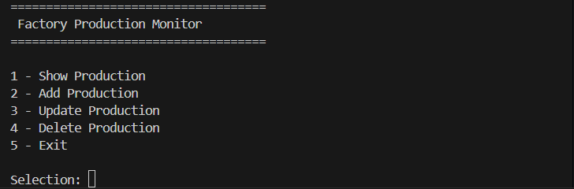
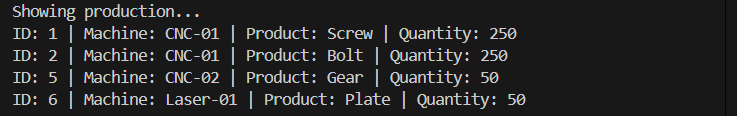
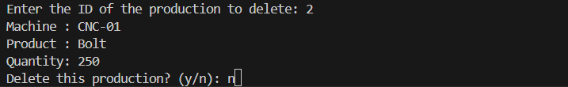

# Factory Production Monitor

## Overview

Factory Production Monitor is a simple C# console application developed as a learning and portfolio project.

The application allows users to manage production records by creating, viewing, updating, and deleting entries. The project focuses on learning object-oriented programming, clean code, CRUD operations, and database integration using SQLite.

---

## Features

* Add production records
* View all production records
* Update existing production records
* Delete production records
* Persistent data storage with SQLite

---

## Technologies

* C#
* .NET 10
* Object-Oriented Programming (OOP)
* SQLite
* Microsoft.Data.Sqlite
* ADO.NET

---

## Current Status

The application stores production records persistently using a SQLite database.

Implemented features include:

* Create, Read, Update, Delete (CRUD)
* SQLite database integration
* Parameterized SQL queries
* Input validation
* Confirmation before deleting records

---

## Screenshots

### Main Menu

### Production Records

### Delete Confirmation

---

## Learning Goals

This project is intended to practice:

* Object-oriented programming
* Working with classes and methods
* CRUD operations
* Clean code principles
* Git and GitHub workflow
* Database integration with SQLite
* Working with SQLite databases
* Using ADO.NET for database access
* Writing parameterized SQL queries

---

## License

The source code of this project is licensed under the MIT License. See the [LICENSE](LICENSE) file for details.